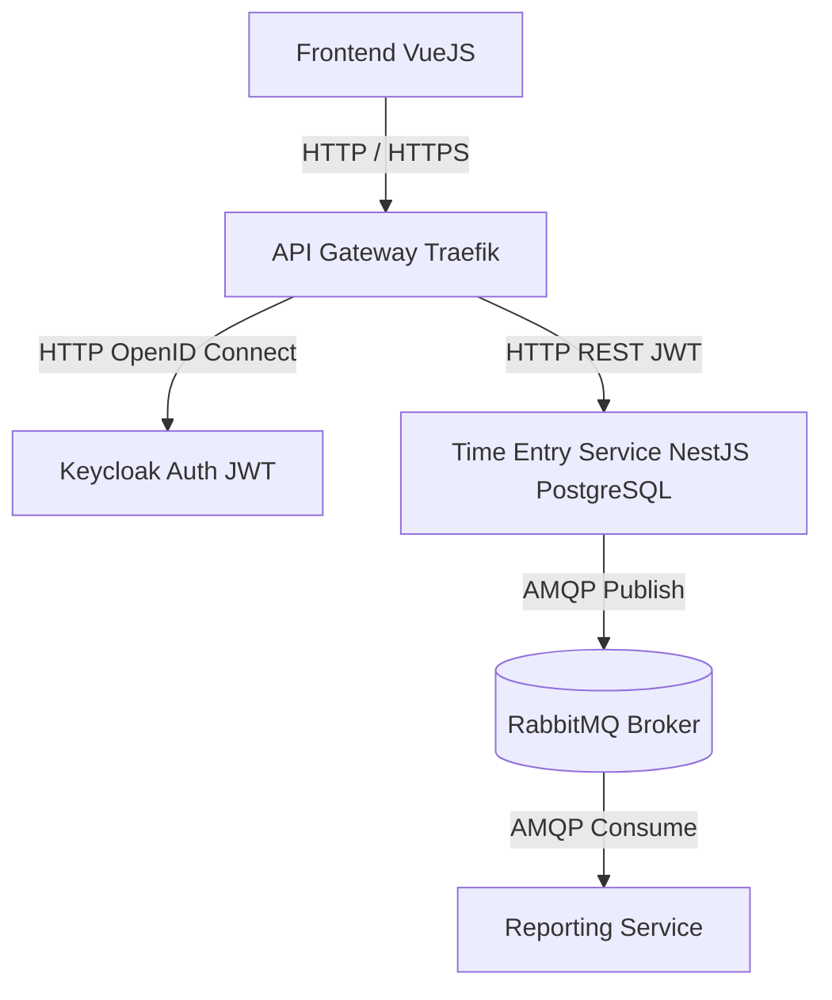

Architecture (Environnement Local)

Le projet TimeTracker est conçu comme un système distribué local-first, entièrement exécutable en local via Docker Compose.
Chaque composant du système fonctionne comme un service indépendant, communiquant au travers d’API REST ou d’un message broker.

Cette architecture permet de couvrir les notions clés du module 321 :

microservices

systèmes distribués

message broker (pub/sub)

authentification centralisée (OpenID / OAuth2 / JWT)

résilience, idempotence, séparation des responsabilités

monitoring et documentation d’API

Vue d'ensemble du système

Le système est composé de six services principaux :

API Gateway — point d’entrée unique pour toutes les requêtes

Auth Service (Keycloak) — gestion des utilisateurs et des tokens JWT

Time Entry Service — service métier pour la saisie d’heures

Reporting Service — génération de statistiques via pub/sub

Message Broker (RabbitMQ) — transport des événements

Base de données — stockage persistant (PostgreSQL)

Schéma simplifié :

1️⃣ API Gateway

Traefik ou Caddy
➡️ Point d'entrée unique pour toutes les requêtes
➡️ Route vers Keycloak et TimeEntry

2️⃣ Keycloak (Auth Service)

➡️ Gestion des utilisateurs
➡️ OpenID Connect / OAuth2
➡️ Fournit les JWT pour sécuriser les API

3️⃣ Time Entry Service

NestJS / Node.js + PostgreSQL
➡️ CRUD d’entrées de temps
➡️ Publie des événements AMQP vers RabbitMQ

4️⃣ RabbitMQ (Message Broker)

➡️ Transporte les messages internes
➡️ Sert de lien entre TimeEntry et Reporting

5️⃣ Reporting Service

Node.js ou Python
➡️ Consomme les événements AMQP
➡️ Génère des statistiques → exposées via API

🧩 Services de l’architecture
1. API Gateway

Le point d’entrée unique du système.
Il reçoit toutes les requêtes du Frontend et les redirige vers les services appropriés.
Il permet également de simplifier les URLs, d’unifier les accès et d’ajouter une couche de sécurité.

Technologie recommandée : Traefik ou Caddy
Responsabilités :

Router les requêtes vers Keycloak et le Time Entry Service

Servir de proxy central

Gérer éventuellement HTTPS et les règles d’accès

2. Keycloak (Auth Service)

Le service d’authentification et d’autorisation du système.
Il gère les utilisateurs, les sessions, les rôles et délivre les tokens JWT utilisés pour sécuriser les communications entre le frontend et les services REST.

Technologie : Keycloak
Responsabilités :

Authentification des utilisateurs (OpenID Connect)

Délivrance des tokens JWT

Gestion des rôles et permissions (RBAC)

Endpoints de login / logout

3. Time Entry Service

Le service métier principal du système.
Il expose une API REST permettant de créer, lire, modifier et supprimer des entrées de temps.
Il publie également des événements AMQP à destination du Reporting Service.

Technologies recommandées : Node.js (NestJS) + PostgreSQL
Responsabilités :

CRUD des entrées de temps

Vérification des tokens JWT reçus via l’API Gateway

Stockage des données dans PostgreSQL

Publication d’événements AMQP (time.entry.created / updated) vers RabbitMQ

4. RabbitMQ (Message Broker)

Le système de messagerie asynchrone du projet.
Il permet aux services de communiquer entre eux via le pattern Publish/Subscribe tout en restant découplés.

Technologie : RabbitMQ
Responsabilités :

Transport des messages internes

Réception des événements publiés par le Time Entry Service

Diffusion des messages au Reporting Service

Gestion des files et des retries en cas d’erreurs

5. Reporting Service

Le service responsable du traitement et de l’analyse des données reçues depuis RabbitMQ.
Il consomme les événements publiés par le Time Entry Service et génère un modèle de lecture optimisé (read model).

Technologies recommandées : Node.js ou Python
Responsabilités :

Consommer les messages AMQP provenant de RabbitMQ

Calculer des statistiques (par utilisateur, par projet, par date, etc.)

Stocker un modèle de lecture séparé (ex. PostgreSQL ou Redis)

Exposer une API REST dédiée au reporting