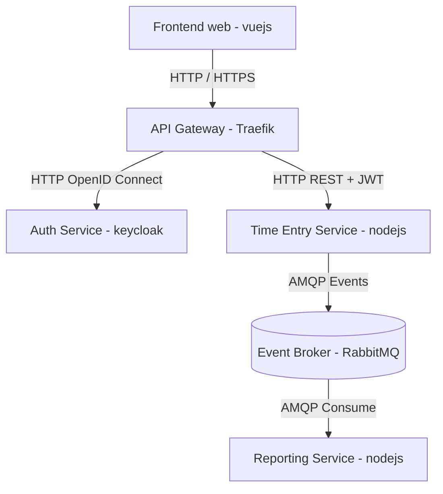

# Projet 321 TimeTracker

Le projet TimeTracker est conçu comme un système distribué local-first, entièrement exécutable en local via Docker Compose.
Chaque composant du système fonctionne comme un service indépendant, communiquant au travers d’API REST ou d’un message broker.

## Schéma simplifié

## 🧩 Liste des services
### 1. Frontend Web
Interface utilisateur accessible depuis le navigateur.
Il communique uniquement avec l’API Gateway et utilise Keycloak pour l’authentification.

Technologies possibles : Vue.js, React, Svelte  
Responsabilités :
- Afficher les écrans de saisie et de reporting
- Gérer le login via Keycloak
- Envoyer des requêtes REST signées (JWT)

#### Détails :
 to complete ...

---
### 2. API Gateway
Point d’entrée unique du système.
Il redirige le trafic vers les services internes et protège l’architecture.

Technologies possibles : Traefik, Caddy, Nginx  
Responsabilités :
- Router les requêtes vers Keycloak, Time Entry Service et Reporting
- Exposer les endpoints unifiés (ex. /api/…)
- Jouer le rôle de reverse proxy

#### Détails :
Lancement du docker compose up  
Tout se trouve dans le dossier traefik

---

### 3. Auth Service (Keycloak)
Service centralisé d’authentification et d’autorisation.
Il gère les utilisateurs et délivre les tokens JWT utilisés pour sécuriser les services backend.

Technologie : Keycloak  
Responsabilités :
- Authentifier les utilisateurs via OpenID Connect
- Gérer les rôles et permissions
- Émettre et valider les tokens JWT
 

#### Détails :
Accès sur : http://localhost:8081 (après le docker compose up)  
- Login : admin / admin
- Créer un realm timetracker : Menu en haut à gauche → “Create realm” - nom timetracker - save
- Créer un client pour le frontend - Aller dans le realm timetracker - 
    - Menu “Clients” → “Create client”
    - Client ID : timetracker-frontend
    - Type : OpenID Connect
    - “Root URL” (si demandé) : http://localhost:5173 (Vite)
- Ensuite, dans la config du client :
    - “Access type” : public
    - “Valid redirect URIs” : http://localhost:5173/*
    - “Web origins” : http://localhost:5173 ou * pour tester

---

### 4. Time Entry Service
Service métier principal chargé de la gestion des entrées de temps.
Il publie également des événements à destination du Reporting Service.

Technologies recommandées : Node.js (NestJS) + PostgreSQL  
Responsabilités :
- CRUD des entrées de temps
- Validation des tokens JWT
- Stockage des données dans PostgreSQL
- Publication d’événements AMQP vers RabbitMQ

 

#### Détails :
Tout dans le dossier time-entry-service

---

### 5. Event Broker (RabbitMQ)
Système de messagerie asynchrone assurant la communication entre les services.
Il implémente le modèle Publish/Subscribe.

Technologie : RabbitMQ (AMQP)  
Responsabilités :
- Transport des événements internes
- Gestion des files, des retries et de la résilience
- Découplage entre Time Entry Service et Reporting Service

#### Détails :
container rabbitmq sur port 5672

---

### 6. Reporting / Analytics Service
Service chargé de consommer les événements et de produire un modèle de lecture optimisé.

Technologies possibles : Node.js, Python, Redis ou PostgreSQL  
Responsabilités :
- Consommer les messages provenant de RabbitMQ
- Calculer les statistiques de temps
- Maintenir un read-model optimisé
- Exposer une API REST pour le reporting

#### Détails :
Tout dans le dossier reporting-service et container_name: reporting-service
