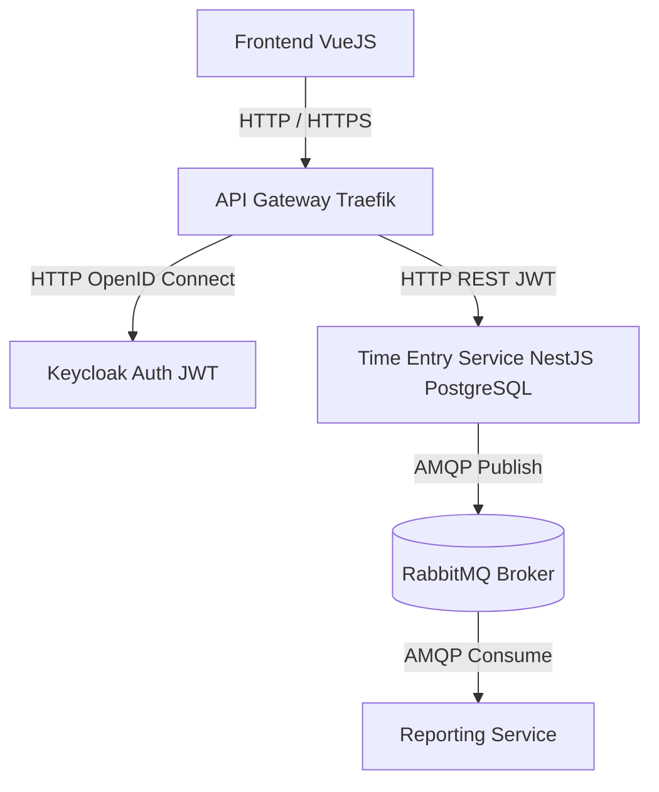

Architecture (Environnement Local)

Le projet TimeTracker est conçu comme un système distribué local-first, entièrement exécutable en local via Docker Compose.
Chaque composant du système fonctionne comme un service indépendant, communiquant au travers d’API REST ou d’un message broker.

Cette architecture permet de couvrir les notions clés du module 321 :

microservices

systèmes distribués

message broker (pub/sub)

authentification centralisée (OpenID / OAuth2 / JWT)

résilience, idempotence, séparation des responsabilités

monitoring et documentation d’API

Vue d'ensemble du système

Le système est composé de six services principaux :

API Gateway — point d’entrée unique pour toutes les requêtes

Auth Service (Keycloak) — gestion des utilisateurs et des tokens JWT

Time Entry Service — service métier pour la saisie d’heures

Reporting Service — génération de statistiques via pub/sub

Message Broker (RabbitMQ) — transport des événements

Base de données — stockage persistant (PostgreSQL)

Schéma simplifié :

## 1. API Gateway
Le point d’entrée unique du système. Il reçoit toutes les requêtes du Frontend et les redirige vers les services appropriés. Il simplifie les URLs, applique une couche de sécurité et peut gérer HTTPS.
Technologie recommandée : Traefik ou Caddy
Responsabilités :
- Router les requêtes vers Keycloak et le Time Entry Service
- Centraliser l’accès
- Gérer les règles HTTP

## 2. Keycloak (Auth Service)
Service d’authentification et d’autorisation du système. Il gère les utilisateurs, les rôles et délivre les tokens JWT utilisés pour sécuriser les services.
Technologie : Keycloak
Responsabilités :
- Authentification via OpenID Connect
- Délivrance de tokens JWT
- Gestion des rôles RBAC
- Endpoints de login/logout

## 3. Time Entry Service
Service métier principal du système. Il expose une API REST permettant de créer, lire, modifier et supprimer des entrées de temps.
Technologies recommandées : Node.js (NestJS) + PostgreSQL
Responsabilités :
- CRUD des entrées de temps
- Vérification des tokens JWT
- Stockage dans PostgreSQL
- Publication d’événements AMQP vers RabbitMQ

## 4. RabbitMQ (Message Broker)
Système de messagerie interne basé sur AMQP. Il permet aux services de communiquer de manière asynchrone, sans dépendance directe.
Technologie : RabbitMQ
Responsabilités :
- Transport d’événements internes
- Découplage entre services
- Gestion des files, retries et dead-letter queues

## 5. Reporting Service
Service dédié à l’analyse et au traitement des événements provenant de RabbitMQ.
Technologies : Node.js ou Python
Responsabilités :
- Consommer les messages AMQP
- Calculer des statistiques
- Maintenir un read-model optimisé
- Fournir une API REST pour les rapports
